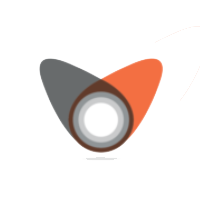
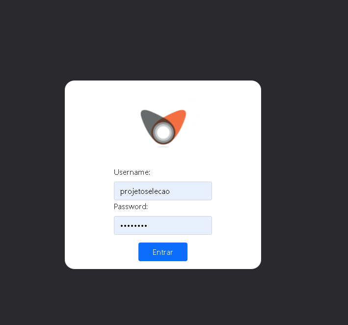
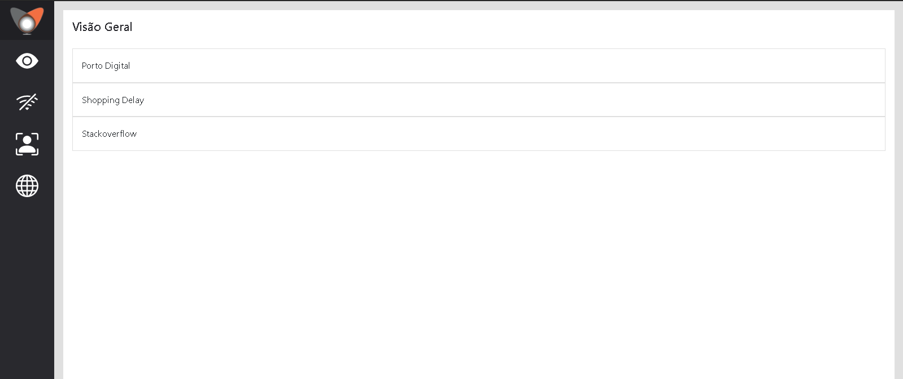
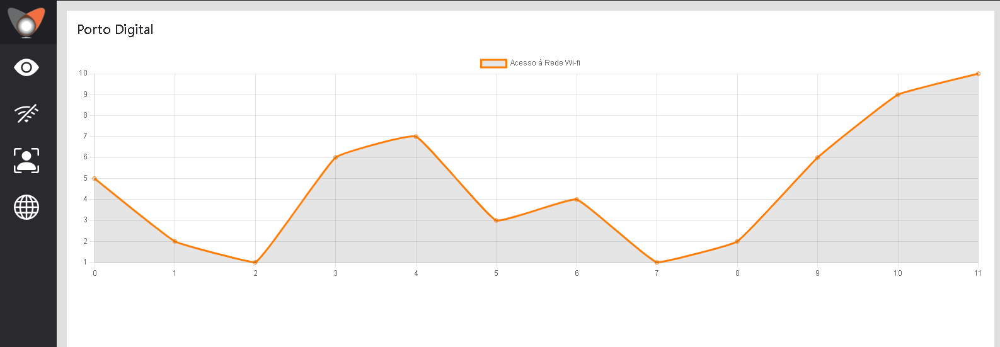
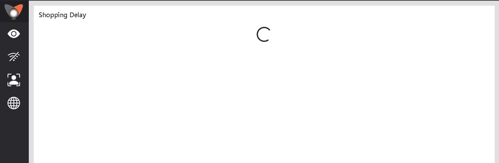
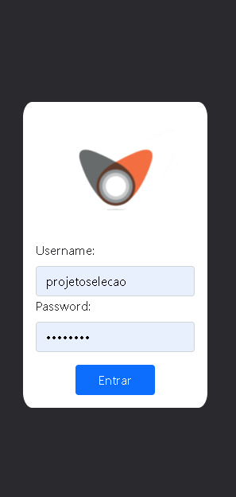

  
   

<h1 align='center'>Seleção Front-end Vagalume (ReactJS) </h1>

  

 
  
  
  

 <a href="#eye_speech_bubble-preview">Preview</a> •
 <a href="#information_source-about">About</a> •
 <a href="#arrow_forward-run">Run</a> •
 <a href="#hammer_and_wrench-technologies">Technologies</a> •
 <a href="#boy-author">Author</a> 

---
## :information_source: About

- Projeto desenvolvido para a seleção de estágio para Front-end. Escolhi o **ReactJS** para desenvolver o projeto por estar, atualmente, estudando essa tecnologia e por saber que a componentização do código facilitaria no desenvolvimento, além do uso dos States e Hooks para trabalhar com os dados recebidos de forma assíncrona. 
- O React-Router possibilita a navegação entre as páginas da aplicação.
- O Axios, pacote que utilizei para consumir as rotas, permite que uma URL base seja definida e todo o resto do consumo das rotas seja feito apenas com a mudança dos parâmetros da URL, além de possibilitar setar de forma fácil o token de autorização para consumo da rota no Header da requisição.
- O ChartJS é uma lib que permite renderizar diversos tipos de gráficos de forma fácil e prática, além disso é possível trabalhar com esses gráficos como React Components, que traz dinamicidade ao código. 

---
## :eye_speech_bubble: **Preview**

### :desktop_computer: Desktop
  
  
  
  
  
  
### :iphone: Responsive
   
   
   
   
   
  

  
---
## :arrow_forward: **Run**

To run the project you need to clone or [`download`](https://github.com/lucasyule2212/Estagio-Vagalume/archive/main.zip) this repository, have the Node Package Manager ([`NPM`](https://www.npmjs.com/get-npm)) or the YARN Package Manager installed ([`YARN`](https://yarnpkg.com/getting-started)).

---
## :hammer_and_wrench: **Technologies**

The following tools is used to build this project:

|:globe_with_meridians: Web|:ribbon: Styling|
|:---:| :---:|
|ReactJS| SASS|  
|TypeScript| Bootstrap|  
|Axios| ChartJS| 

---
## :boy: **Author**

<a href="https://github.com/lucasyule2212">
 
   
 <b>Lucas Yule</b>
</a>

Developed with ❤️ by Lucas Yule 👋🏽 Contact me!

